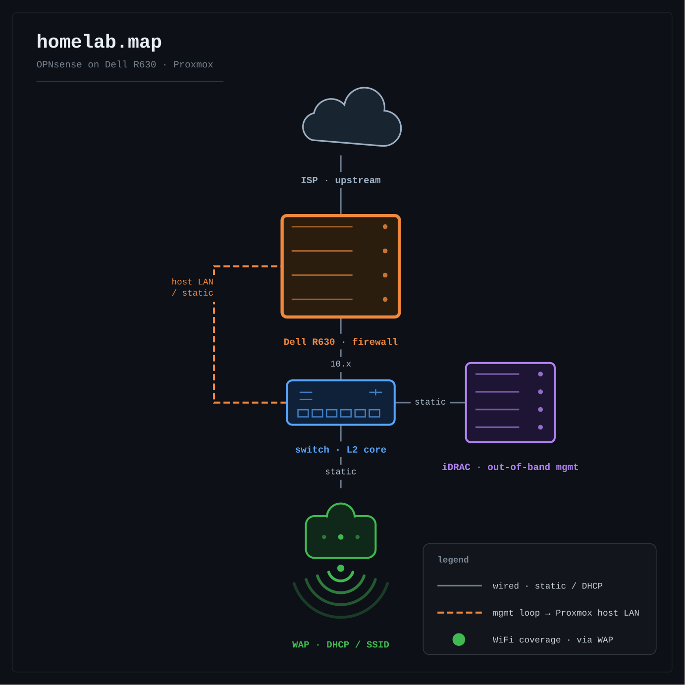

# homelab

The infrastructure I run at home and on a public VPS, documented layer by layer.

## What this is

- A working record of building platform infrastructure the way it actually gets built: one layer of the stack at a time, each one running on real hardware with real services on top of it.
- The systems behind it are live — a Dell R630 on Proxmox, an OPNsense firewall in front of the house network, a public internet-facing VPS, and services other people use. Nothing here is a lab exercise that gets deleted afterwards.
- Each layer gets one write-up that grows as the work happens, covering what I built, what broke, how I found the cause, and what I'd do differently.

## Current status

Layer 01, networking — in progress. OPNsense is migrated onto the R630 and the whole LAN routes through it. VLAN segmentation, WireGuard remote access, firewall rule documentation and subnetting notes are still open.

## Network

The Dell R630 is the network edge: the ISP feed lands on its WAN NIC, and an OPNsense VM running on that host routes and firewalls everything behind it. The network is a single flat subnet today — segmentation is planned inside this layer, so this diagram gets replaced as the topology changes. Source file: `diagrams/homelab.map.drawio`.

## Layers

| # | Layer | Status | Write-up |
|---|-------|--------|----------|
| 01 | Networking | In progress | [01-networking.md](writeups/01-networking.md) |
| 02 | Linux ops | Next | — |
| 03 | Containers | Planned | — |
| 04 | Kubernetes | Planned | — |
| 05 | Observability | Planned | — |
| 06 | Automation & IaC (Ansible, Terraform, AWS) | Planned | — |
| 07 | GPU & model serving | Planned | — |
| 08 | Storage & backups | Planned | — |
| 09 | CI/CD & GitOps | Planned | — |
| 10 | Hardening | Planned | — |

Once layer 10 closes, the list repeats from the top, one notch deeper.

## Repo layout

    homelab/
    ├── README.md
    ├── writeups/
    │   └── 01-networking.md
    ├── diagrams/
    │   ├── homelab.map.drawio
    │   └── homelab.map.preview.png
    └── network/            sanitised configs and notes for layer 01

Later layers add their own write-up and folder as they open.

Everything committed here is sanitised: no public addresses, keys, credentials or hardware identifiers. Private RFC1918 addressing is left in because the topology is meaningless without it.

Python tooling written alongside this work — exporters, health checkers, load generators, CLIs — lives in its own repositories, not here.
